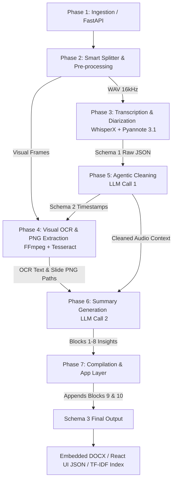

<div align="center">
  

  <a href="https://github.com/rahul14rx/capegemini_final">
    
  </a>
</div>

<p align="center">
  <b>A deep technical architecture executing a dual-pipeline multimodal fusion strategy. We parallelize Audio and Video processing into a strictly structured 3-Schema JSON pipeline, finalized by an Agentic Execution engine.</b>
</p>

<div align="center">
  
  
  
  
  
  
  
</div>

---

<h2 style="color: #8B4513;">Architecture Diagram</h2>


---

<h2 style="color: #8B4513;"> The 7-Phase Methodology Pipeline</h2>

Botzilla diverges from standard linear summarization by explicitly forking the workload into a synchronized trilateral execution path.



---

<h2 style="color: #8B4513;"> Core Innovations</h2>

* **Dual-Agent Sequencing:** We decoupled LLM calls. Call #1 (Cleaner) filters noise and calculates `pause_before_seconds` boundaries. Call #2 (Summary) executes purely on sanitized data yielding high-fidelity insights.

* **Token Payload Optimization (300% Reduction):** By using segment-level timestamps instead of word-level, and stripping hardware logs before Call #1, we drastically reduced LLM context windows while maintaining strict forensic auditability.

* **Native Visual Embedding:** Our Node.js compilation layer dynamically stitches physical slide PNGs directly into the generated DOCX artifacts (either inline or clustered in an appendix).

* **Native Hinglish Resilience:** Engineered to avoid brittle translation layers. By flagging (`is_filler_only = true`) instead of translating, we preserve localized slang and critical meeting sentiment.

---

<h2 style="color: #8B4513;"> Challenges Overcome</h2>

| Challenge | Resolution Architecture |
| :--- | :--- |
| **Diarization Drift** <br> *(Overlapping speech fragmentation)* | Implemented `VERY_SHORT_SEGMENT_THRESHOLD = 0.5s` and `LOW_CONFIDENCE_THRESHOLD = 0.70` to discard sub-second fragmented overlaps before they poison the LLM context. |
| **Hinglish Context Loss** <br> *(Lost intent via translation)* | Curated a localized filler word registry. Flagged segments bypass translation to ensure the Summary Model receives raw, sentiment-accurate domains slang. |
| **Visual Context Gap** <br> *("As you can see on this chart...")* | Engineered a smart FFmpeg scene-detection pipeline (`0.02 SCENE_CHANGE_THRESHOLD`, `-fps_mode vfr`) to catch un-announced slide transitions and force them into the OCR and DOCX pipeline. |

---

<h2 style="color: #8B4513;"> Environment Execution & Run Commands</h2>

Follow this execution order to initialize both backend runtimes locally.

<h3 style="color: #8B4513;">1. Python Engine Setup</h3>
Install the necessary processing tools and runtime libraries inside the worker directory.

```bash
cd videoocr
pip install -r requirements.txt
```

<h3 style="color: #8B4513;">2. Node.js Application Layer Setup</h3>
Navigate to the application routing directory to download engine modules and launch the development pipeline tracker.

```bash
cd Botzilla
npm install
npm run dev
```

---
<div align="center">
  <i>Engineered for the Capgemini Exceller AgentifAI Buildathon Final Phase.</i>
</div>
